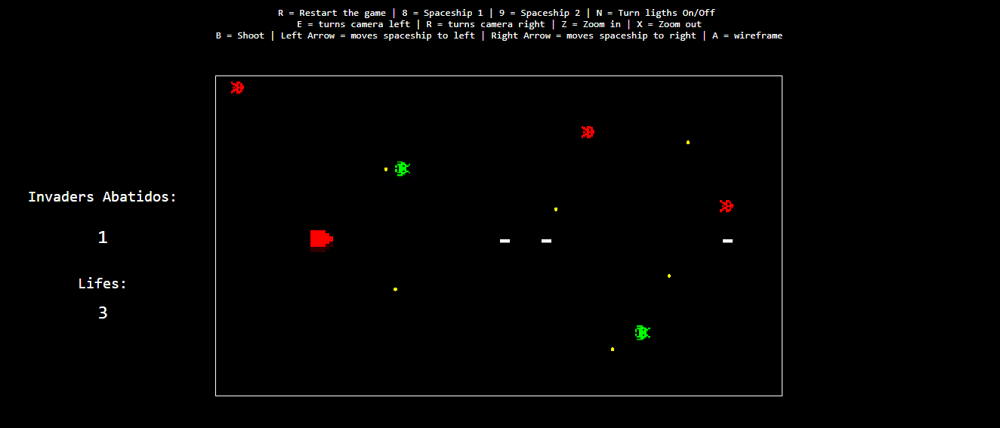

# Space-Invaders
Space Invaders Game

This game was developed in a academic context for the Computer Graphics' subject. The project consisted in creating the Space Invaders game using Javascript and its 3D Library, THREE.js.

HOW TO PLAY:

Start the game by choosing one spaceship: Press 8 or 9

R = Restart the game

Left Arrow = moves spaceship to left

Right Arrow = moves spaceship to right

B = Shoot 

N = Turn ligths On/Off 

E = turns camera left 

R = turns camera right 

Z = Zoom in 

X = Zoom out 

A = wireframe
